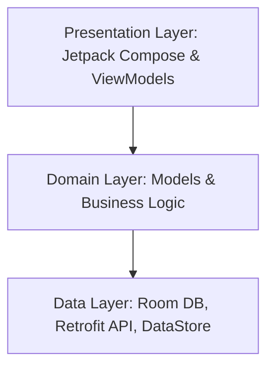

# FarmPulse — AI-powered weather and farm health for Kenyan farmers

FarmPulse is a modern Android application designed to empower Kenyan farmers with hyper-local weather insights and AI-driven farm health diagnostics. By leveraging high-resolution weather data and computer vision, FarmPulse helps farmers make informed decisions about planting, irrigation, and crop care.

## 🏗 Architecture
The app follows a clean architecture pattern separated into three distinct layers:



- **Presentation**: UI built entirely with Jetpack Compose. ViewModels manage UI state and observe data flows.
- **Domain**: Pure Kotlin models and repository interfaces that define the core business logic.
- **Data**: Implementation of repositories using Room for offline persistence, Retrofit for network communication, and DataStore for user preferences.

## ✨ Features & API Integration
| Feature | API Endpoint | Description |
|:--- |:--- |:--- |
| **Hyper-local Weather** | `/v1/weather-geo` & `/v1/weather` | Discovers location via IP and fetches detailed current/hourly conditions. |
| **7-Day Forecast** | `/v1/weather` | Provides a comprehensive 7-day outlook including rain probability charts. |
| **Tree Scanner** | `/v1/trees/analyze` | Uses computer vision to count trees and assess health from farm photos. |
| **Scan History** | `/v1/trees/history` | Maintains a local record of all past farm health analyses. |
| **AI Weather Summaries** | `/v1/weather` (ai=true) | Generates natural language weather insights in English or Swahili. |
| **Usage Tracking** | `/v1/usage` | Monitors API quota and plan limits in real-time within Settings. |

## 📸 Screenshots
### Home Screen

*(Note: Replace with your actual hosted image link)*

## 📡 Offline Behaviour
FarmPulse implements a **Single Source of Truth (SSOT)** strategy to ensure reliability in remote farming areas:
- **Caching**: All weather and tree analysis data is automatically cached in a local **Room Database**.
- **Persistence**: When the device is offline, the app seamlessly serves the last-known cached data.
- **Visual Feedback**: An offline banner appears on the Home screen showing the exact time the data was last synchronized.
- **Reliability**: Network requests are performed with a fallback mechanism; if a fetch fails, the app restores the UI state from the local cache.

## 🚀 Setup Instructions
To run this project locally, you need a **Weather AI** API key.

1. **Get an API Key**: Sign up at [weather-ai.co](https://weather-ai.co) to obtain your key.
2. **Add to local.properties**:
   Open `local.properties` in your project root and add the following line:
   ```properties
   weatherai.api.key=YOUR_API_KEY_HERE
   ```
3. **Build and Run**: Synchronize Gradle and run the app via Android Studio.
4. **App Configuration**: Alternatively, you can paste your API key directly into the **Settings** tab within the app.

## 📥 APK Download
[Download FarmPulse APK](https://drive.google.com/your-link-here)

## ⚠️ Known Limitations (Free Plan)
The app operates under the following constraints for the free tier:
- **Tree Analysis**: Limited to 5 analyses per month.
- **Forecast Range**: 7 days of forecast data.
- **AI Summaries**: Limited to 200 summary generations per month.
- **Update Frequency**: Data is refreshed every 15 minutes by default.
